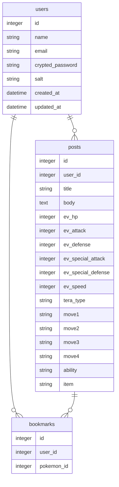

```mermaid
erDiagram
  users ||--o{ posts: ""
  users ||--o{ bookmarks: ""
  posts ||--o{ bookmarks: ""


  users{
    integer id
    string name
    string email
    string crypted_password
    string salt
    datetime created_at
    datetime updated_at
  }

  posts{
    integer id
    integer user_id
    string title
    text body
    integer ev_hp
    integer ev_attack
    integer ev_defense
    integer ev_special_attack
    integer ev_special_defense
    integer ev_speed
    string tera_type
    string move1
    string move2
    string move3
    string move4
    string ability
    string item
  }

  bookmarks{
    integer id
    integer user_id
    integer pokemon_id
  }


```
